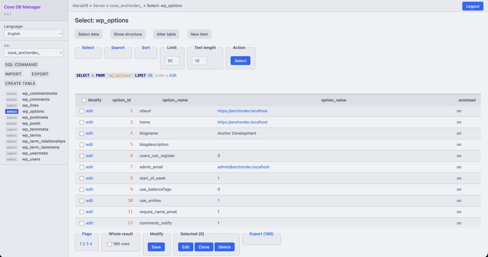
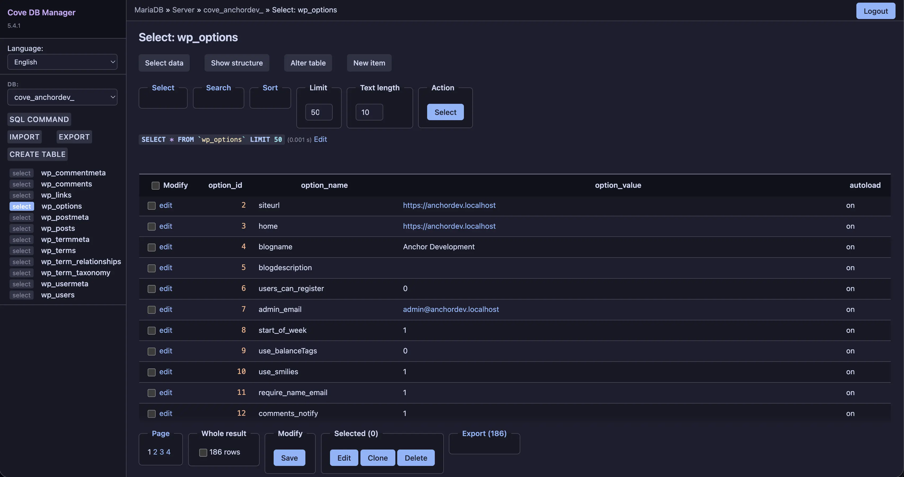

<p align="center">
  <h2 align="center">Catppuccin for Adminer</h2>
</p>

<p align="center">
  <a href="https://github.com/catppuccin/catppuccin">
    
  </a>
</p>

<p align="center">
  Soothing pastel theme for <a href="https://www.adminer.org/">Adminer</a>
</p>

## Previews

<details>
<summary>Latte (Light)</summary>

</details>
<details>
<summary>Mocha (Dark)</summary>

</details>

## About

This theme provides automatic light/dark mode switching based on your system preferences:

- **Light mode**: Catppuccin Latte
- **Dark mode**: Catppuccin Mocha

## Usage

### Option 1: Direct Download

1. Download `adminer.css` from this repository
2. Place it in the same directory as your `adminer.php` file
3. Adminer will automatically load the CSS file

### Option 2: curl

```bash
curl -sL "https://raw.githubusercontent.com/anchorhost/cove/main/adminer-theme/adminer.css" -o adminer.css
```

## Features

- Automatic light/dark mode switching via `prefers-color-scheme`
- Full SQL syntax highlighting with Catppuccin colors
- Styled tables, forms, buttons, and messages
- Fixed sidebar navigation
- Responsive design for smaller screens
- Print-friendly styles

## Color Mapping

| UI Element | Catppuccin Color |
|------------|------------------|
| Background | Base |
| Sidebar | Mantle |
| Text | Text |
| Links | Blue |
| SQL Keywords | Mauve |
| Strings | Green |
| Numbers | Peach |
| Comments | Overlay1 |
| Functions | Blue |
| Success | Green |
| Errors | Red |
| Warnings | Yellow |

## Compatibility

- Adminer 4.x and 5.x
- All modern browsers with CSS custom properties support
- AdminerEvo (fork)

## License

MIT License

## Credits

- [Catppuccin](https://github.com/catppuccin/catppuccin) - The beautiful color palette
- [Adminer](https://www.adminer.org/) - Database management in a single PHP file
- [Cove](https://github.com/anchorhost/cove) - Local WordPress development environment

---

<p align="center">
  <a href="https://github.com/catppuccin/catppuccin/blob/main/docs/style-guide.md">
    
  </a>
</p>
